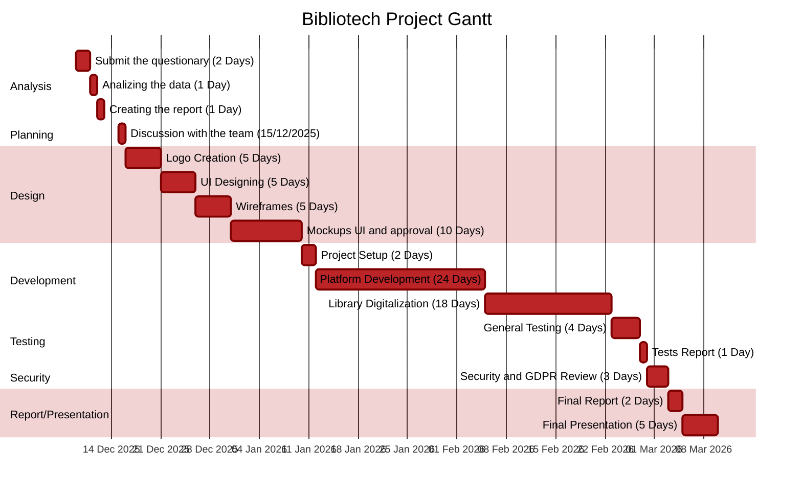

# 5IA – Maserati 
Welcome to the official GitHub organization of **5IA**, the Computer Science class of the *Maserati Technical Institute*.  
This organization hosts projects developed by the students as part of academic and professional training in software development.

---

## 🚀 Main Project
### **📚 Bibliotech**
Bibliotech is our primary project: a digital platform designed to manage, explore, and modernize library systems.  
The project includes backend services, a web application, documentation, and DevOps workflows.

🔗 **Repository:**  
👉 [Bibliotech Repository](https://github.com/5IA-Maserati/Bibliotech)

🔖 **Documentation (Wiki):**  
👉 [Offical Wiki](https://github.com/5IA-Maserati/Bibliotech/wiki)

📊 **Analyst Report**  
👉 [Bibliotech Analyst Report](https://github.com/5IA-Maserati/Bibliotech-Analysis/blob/main/docs/Analyst%20Report.md)

📊 **Gantt Chart:**  

---

## 📄 Documentation Overview
All technical and organizational documentation is maintained in the Bibliotech repository Wiki.  
It includes:

- 📘 **Project Overview**  
- 🏗️ **Architecture & Technologies**  
- 🧩 **Modules & Features**  
- 🚀 **How to Run the Project**  
- 🧪 **Testing Guidelines**  
- 🛠️ **Development Guidelines**  
- 🤝 **Team Roles & Contributions**

---

## 🧑‍💻 Development Practices
We follow modern software engineering practices:

- **Version Control with Git & GitHub**
- **Pull Request reviews**
- **Branch naming conventions**
- **Markdown-based documentation**
- **Automated linting (CI)**

---

## 🌐 Communication & Collaboration
Our team collaborates using:

- GitHub Issues & Projects for task tracking  
- GitHub Discussions for technical questions  
- Wiki for centralized documentation  

---

## 📬 Contact & Team
This organization represents the **5IA class**, supervised by the Maserati Technical Institute.  
For project-related inquiries, please create an Issue in the relevant repository.

---

### ⭐ If you find our work interesting, feel free to follow the organization or star the project!  

      \    /\
       )  ( ')
      (  /  )
       \(__)|
